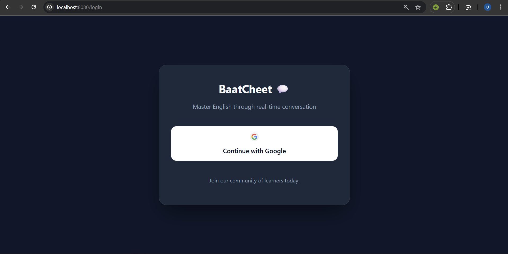
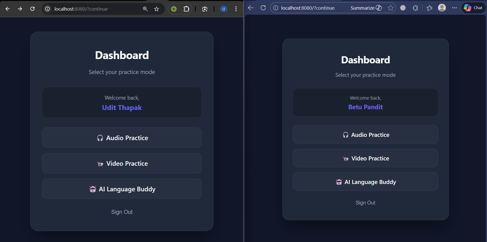
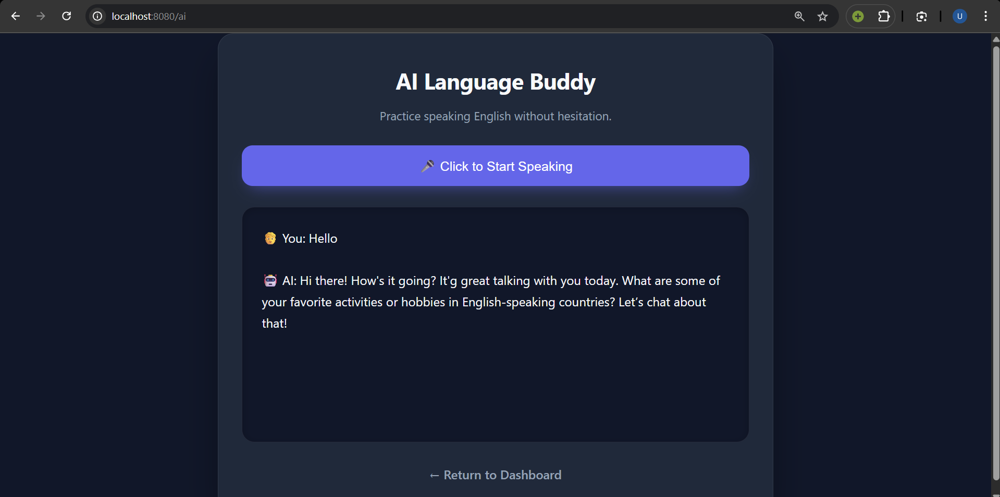
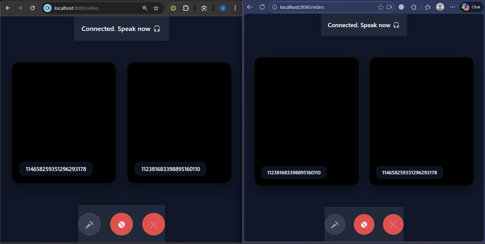

# BaatCheet 💬

**BaatCheet** is a real-time, peer-to-peer communication web application designed to help users master their English speaking skills. Whether you want to practice with a random partner via audio/video or speak with an AI language buddy without hesitation, BaatCheet provides a sleek, modern, and safe environment to learn.

---

## ✨ Features

- 🔐 **Secure Authentication** — Seamless login using Google OAuth2  
- 📹 **Video Practice** — Real-time peer-to-peer video calls using WebRTC  
- 🎧 **Audio Practice** — Anonymous voice-only rooms for camera-free practice  
- 🤖 **AI Language Buddy** — Local privacy-first chatbot powered by Ollama  
- ⚡ **Low Latency Signaling** — WebSockets for instant matchmaking  
- 🎨 **Modern UI/UX** — Responsive dark-mode interface with sleek design  

---

## 🖼️ Screenshots

### 🔐 Login Page


### 📊 Dashboard


### 🤖 AI Language Buddy


### 📹 Video Call


---

## 🛠️ Tech Stack

### Frontend
- HTML5
- CSS3 (Modern Glassmorphism + Dark Theme)
- JavaScript (WebRTC API, Web Speech API, WebSockets)
- Thymeleaf

### Backend
- Java 17+
- Spring Boot 3
- Spring Security (OAuth2 Client)
- Spring WebSockets
- Ollama Integration (Local LLM)

---

## 🚀 Getting Started

Follow these steps to run the project locally.

---

### Prerequisites

Make sure you have installed:

- Java JDK 17+
- Maven
- Ollama (for AI Language Buddy)

---

### 1. Clone Repository

```bash
git clone https://github.com/your-username/baatcheet.git
cd baatcheet
```

---

### 2. Setup Google OAuth2

To enable Google login:

1. Open Google Cloud Console
2. Create a new project
3. Go to **APIs & Services → Credentials**
4. Create **OAuth Client ID (Web Application)**
5. Add redirect URI:

```
http://localhost:8080/login/oauth2/code/google
```

6. Copy Client ID + Secret

Update:

`src/main/resources/application.yml`

```yaml
spring:
  security:
    oauth2:
      client:
        registration:
          google:
            client-id: YOUR_GOOGLE_CLIENT_ID
            client-secret: YOUR_GOOGLE_CLIENT_SECRET
```

---

### 3. Start Ollama Model

Pull and run the model used by backend:

```bash
ollama run llama3
```

(Or replace with your configured model like `mistral`)

---

### 4. Run Application

```bash
./mvnw spring-boot:run
```


## 📁 Project Structure

```
baatcheet/
├── src/main/java/com/baatcheet/
│   ├── config/          # Security & WebSocket configuration
│   ├── controller/      # REST APIs and page routing
│   ├── dto/             # Data transfer objects
│   ├── service/         # Business logic
│   └── websocket/       # WebRTC signaling handlers
├── src/main/resources/
│   ├── static/          # CSS & client-side JS
│   ├── templates/       # Thymeleaf HTML views
│   └── application.yml  # App configuration
└── pom.xml
```

---

## 🤝 Contributing

Contributions are welcome!

1. Fork the project  
2. Create branch  
   ```
   git checkout -b feature/AmazingFeature
   ```
3. Commit changes  
   ```
   git commit -m "Add AmazingFeature"
   ```
4. Push  
   ```
   git push origin feature/AmazingFeature
   ```
5. Open Pull Request

---

## 👨‍💻 Built By

**Udit Thapak**

---

⭐ If you like this project, consider starring the repo!
